# Windows Doors Website React

## Project Overview

This repository contains the code for a 100% exact clone of the Window World LA website (https://www.windowworldla.com/). The goal is to recreate the website exactly as it is, preserving all functionality, design elements, and content.

The project uses React.js for the frontend and Next.js for the backend, with Tailwind CSS for styling. We're utilizing Context7 MCP server and Crawl4AI for web scraping to extract all pages, content, functionality, and technical elements from the original website.

Our implementation ensures the clone is fully accessible, SEO optimized, and integrates seamlessly with our current tech stack.

## Documentation Structure

This project follows a pyramid documentation structure with this README as the single entry point. All documentation is organized hierarchically as shown in the diagram below:

```mermaid
graph TD
    README[README.md] --> ProjectTasks[Project Tasks]
    README --> PriorityList[Priority Task List]
    README --> DailyLog[Daily Log]
    README --> DocMap[Documentation Map]
    README --> DocsDir[Documentation Directory]

    DocsDir --> Architecture[Architecture]
    DocsDir --> Features[Features]
    DocsDir --> Guides[Guides]
    DocsDir --> Integrations[Integrations]
    DocsDir --> Planning[Planning]
    DocsDir --> Processes[Processes]
    DocsDir --> Testing[Testing]
    DocsDir --> Templates[Templates]
    DocsDir --> Archived[Archived]
    DocsDir --> SearchIndex[Search Index]
    DocsDir --> Overview[Overview]
    DocsDir --> Requirements[Requirements]

    Architecture --> WebArch[Website Architecture]
    Architecture --> SEOStruct[SEO Structure]
    Architecture --> DataFlow[Data Flow]
    Architecture --> ComponentArch[Component Architecture]

    Features --> ProductCatalog[Product Catalog]
    Features --> QuoteSystem[Quote System]
    Features --> GalleryImplementation[Gallery Implementation]
    Features --> ContactForms[Contact Forms]

    Guides --> DevGuide[New Developer Guide]
    Guides --> TSInterface[TypeScript Interface Guide]
    Guides --> DocStandards[Documentation Standards]
    Guides --> DocReviewChecklist[Documentation Review Checklist]

    classDef current fill:#f9f9f9,stroke:#333,stroke-width:2px;
    classDef category fill:#e1f3d8,stroke:#333,stroke-width:2px;
    classDef document fill:#e8f0fe,stroke:#333,stroke-width:2px;

    class README current;
    class DocsDir,Architecture,Features,Guides,Integrations,Planning,Processes,Testing,Templates,Archived,Scripts category;
    class WebArch,SEOStruct,DataFlow,ComponentArch,ProductCatalog,QuoteSystem,GalleryImplementation,ContactForms,DevGuide,TSInterface,DocStandards,DocReviewChecklist document;
```



> **Note**: This diagram represents the logical structure of our documentation. The actual file paths may differ but are being standardized to follow this hierarchy.

For a comprehensive map of all documentation, see the [Documentation Map](./docs/documentation-map.md) and the [Daily Log](./docs/daily-log.md). For all project tasks and their priorities, see the [Project Tasks](./docs/project-tasks.md) and [Priority Task List](./docs/priority-list.md).

## Documentation Directory

All detailed documentation is organized in the [Documentation Directory](./docs/index.md), which serves as the central hub for all project documentation. The documentation is organized into the following categories:

### Main Categories

- [Architecture](./docs/architecture/index.md) - System design and architecture documentation
- [Features](./docs/features/index.md) - Feature implementation documentation
- [Guides](./docs/guides/index.md) - Developer guides and tutorials
- [Integrations](./docs/integrations/index.md) - Integration documentation for external services
- [Planning](./docs/planning/index.md) - Planning documentation and implementation plans
- [Processes](./docs/processes/index.md) - Process documentation
- [Testing](./docs/testing/index.md) - Testing documentation and guidelines

### Key Documents

#### Getting Started
- [Overview](./docs/overview.md) - Core technical details of the Next.js application
- [Requirements](./docs/requirements.md) - Current project requirements
- [New Developer Guide](./docs/guides/new-developer-guide.md) - Step-by-step guide for new developers

#### Architecture & Implementation
- [Website Architecture](./docs/architecture/website-architecture.md) - System architecture and component diagrams
- [SEO Structure](./docs/architecture/seo-structure.md) - SEO optimization strategy
- [Data Flow](./docs/architecture/data-flow.md) - How data flows through the system
- [Component Architecture](./docs/architecture/component-architecture.md) - React component architecture

## Quick Start

1. **Installation**

   ```bash
   npm install
   ```

2. **Development**

   ```bash
   # Start Next.js development server only
   npm run dev

   # Start Context7 MCP server only
   npm run context7

   # Start both servers (recommended for web scraping)
   npm run dev:with-context7
   ```

3. **Web Scraping**

   ```bash
   # Run the crawler script to extract content from Window World LA website
   npm run crawl

   # Or use the crawler admin interface at http://localhost:3000/admin/crawler
   ```

4. **Production Build**

   ```bash
   npm run build
   npm run start
   ```

## Troubleshooting

If you encounter any issues:

1. Make sure you're using the correct Node.js version
2. Try clearing your browser cache
3. Check the console for any JavaScript errors
4. See the [Project Tasks](./docs/project-tasks.md) for planned improvements

## Tech Stack

- Next.js with App Router
- TypeScript
- Tailwind CSS
- React
- Context7 MCP Server for web scraping
- Cheerio for HTML parsing
- Axios for HTTP requests

## Development Workflow

1. Clone the repository
2. Follow the setup instructions in the [New Developer Guide](./docs/guides/new-developer-guide.md)
3. Run the development server with `npm run dev`
4. Make changes and test locally
5. Run tests with appropriate commands
6. Update documentation as needed
7. Submit a PR for review

## License

[Specify your license here]

## Contact

[Your contact information]
