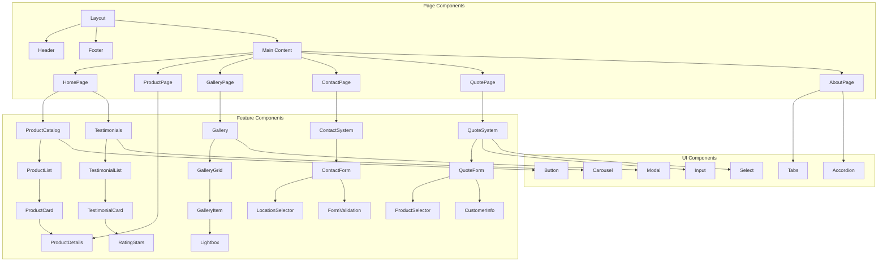
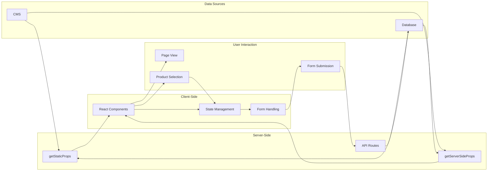
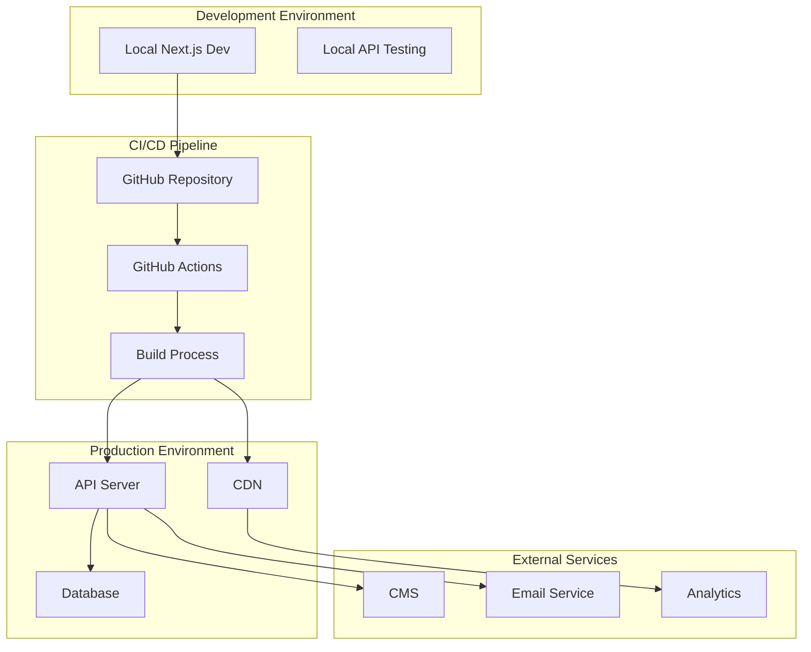

# Website Architecture

> **Breadcrumb Navigation**: [README.md](../../README.md) > [Documentation](../index.md) > [Architecture](./index.md) > Website Architecture

## Overview

This document outlines the architecture of the Windows Doors Website React project, including system components, data flow, and deployment strategy.

## System Architecture

```mermaid
graph TD
    subgraph "Frontend (Next.js)"
        A[Next.js App Router] --> B[Dynamic Routes]
        B --> C1[Product Pages]
        B --> C2[Gallery Pages]
        B --> C3[Static Pages]

        D[Components] --> D1[ProductCatalog]
        D --> D2[QuoteForm]
        D --> D3[Gallery]
        D --> D4[ContactForm]
        D --> D5[Testimonials]
    end

    subgraph "Data Sources"
        F[CMS] --> F1[Product Data]
        F --> F2[Content]
        F --> F3[Images]

        G[Database] --> G1[User Data]
        G --> G2[Quote Requests]
        G --> G3[Analytics]
        G --> G4[Testimonials]
    end

    subgraph "API Layer"
        H[API Routes] --> H1[/api/products]
        H --> H2[/api/quotes]
        H --> H3[/api/contact]
        H --> H4[/api/testimonials]

        I[External APIs] --> I1[Email Service]
        I --> I2[Analytics]
        I --> I3[CRM Integration]
    end

    A --> H
    H --> F
    H --> G
    H --> I
```

## Component Architecture



## Data Flow



## Deployment Architecture



## Related Documentation

- [Component Architecture](./component-architecture.md)
- [Data Flow](./data-flow.md)
- [SEO Structure](./seo-structure.md)
- [URL Structure](./url-structure.md)

Last Updated: May 5, 2025
